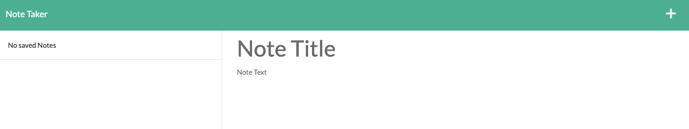

# Note Taker

## Table of Contents
- [Description](#description)
- [Installation](#installation)
- [Technologies](#technologies)
- [Contributing](#contributing)
- [Questions](#questions)

## Description
A small full-stack webapp leveraging node.js and express.js that allows users to create, save, access, and delete simple notes, with an interface reminiscent of the notes app on iOS. 

## Installation
Clone the repo, cd into it, run 'npm i' to install dependencies, and run 'npm start' to run the program locally.

## Technologies
- Node.js
- Express.js
- UUID v4
- Heroku

## Contributing
EdX Boot Camp provided the starter code, as well as much of the fsutils.js helper module, save for the readAndDelete() function.

## Questions

[My GitHub Profile](https://github.com/eschindev)

[Email me!](mailto:eschindler1993@gmail.com)

## License
The MIT License (MIT)

Copyright (c) 2023 Evan Schindler

Permission is hereby granted, free of charge, to any person obtaining a copy of this software and associated documentation files (the "Software"), to deal in the Software without restriction, including without limitation the rights to use, copy, modify, merge, publish, distribute, sublicense, and/or sell copies of the Software, and to permit persons to whom the Software is furnished to do so, subject to the following conditions:

The above copyright notice and this permission notice shall be included in all copies or substantial portions of the Software.

THE SOFTWARE IS PROVIDED "AS IS", WITHOUT WARRANTY OF ANY KIND, EXPRESS OR IMPLIED, INCLUDING BUT NOT LIMITED TO THE WARRANTIES OF MERCHANTABILITY, FITNESS FOR A PARTICULAR PURPOSE AND NONINFRINGEMENT. IN NO EVENT SHALL THE AUTHORS OR COPYRIGHT HOLDERS BE LIABLE FOR ANY CLAIM, DAMAGES OR OTHER LIABILITY, WHETHER IN AN ACTION OF CONTRACT, TORT OR OTHERWISE, ARISING FROM, OUT OF OR IN CONNECTION WITH THE SOFTWARE OR THE USE OR OTHER DEALINGS IN THE SOFTWARE.